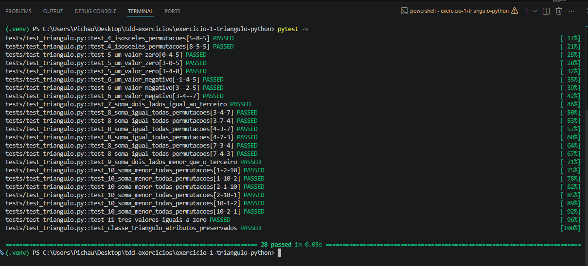
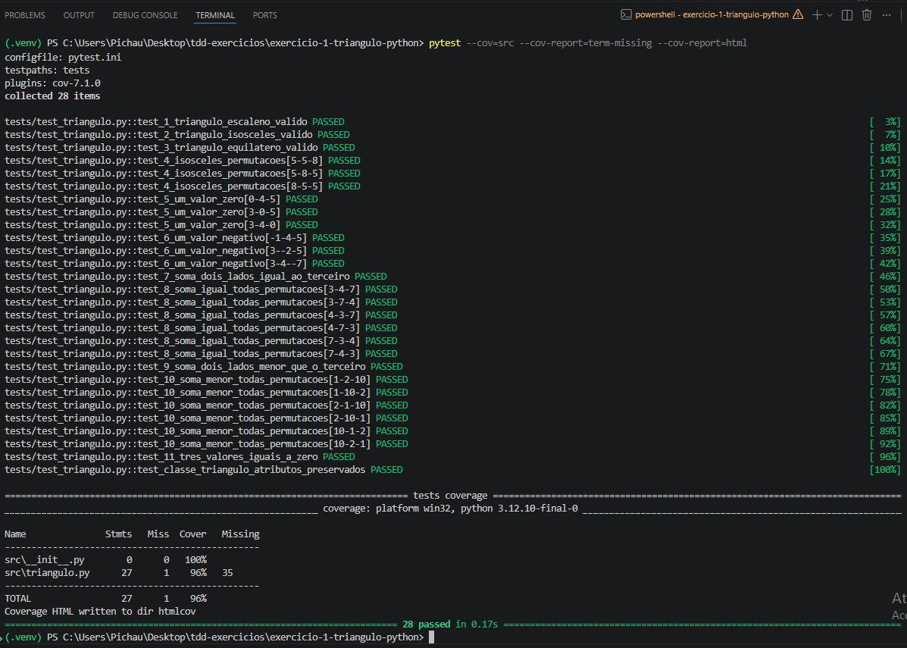
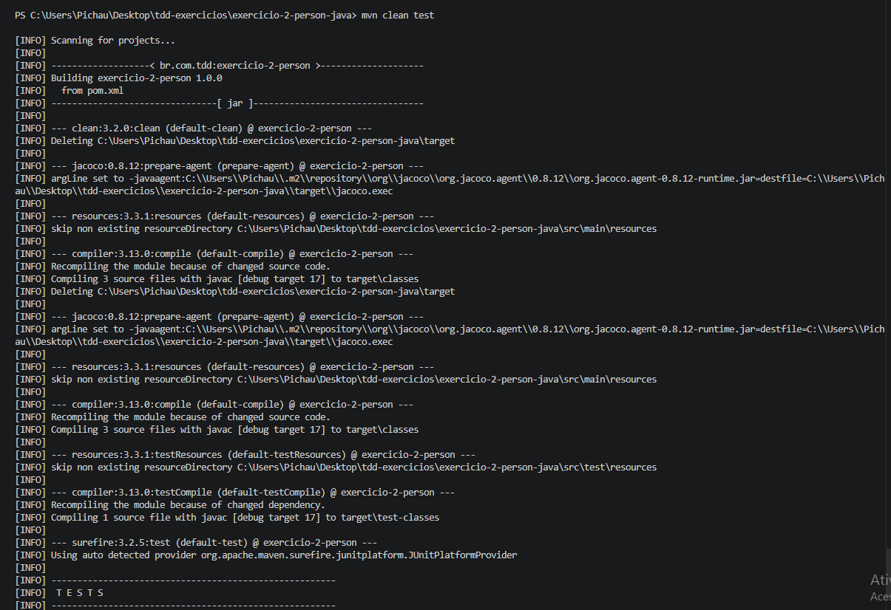
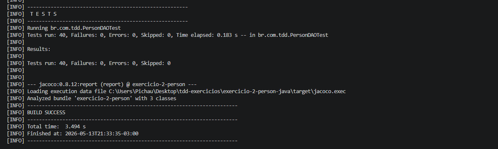
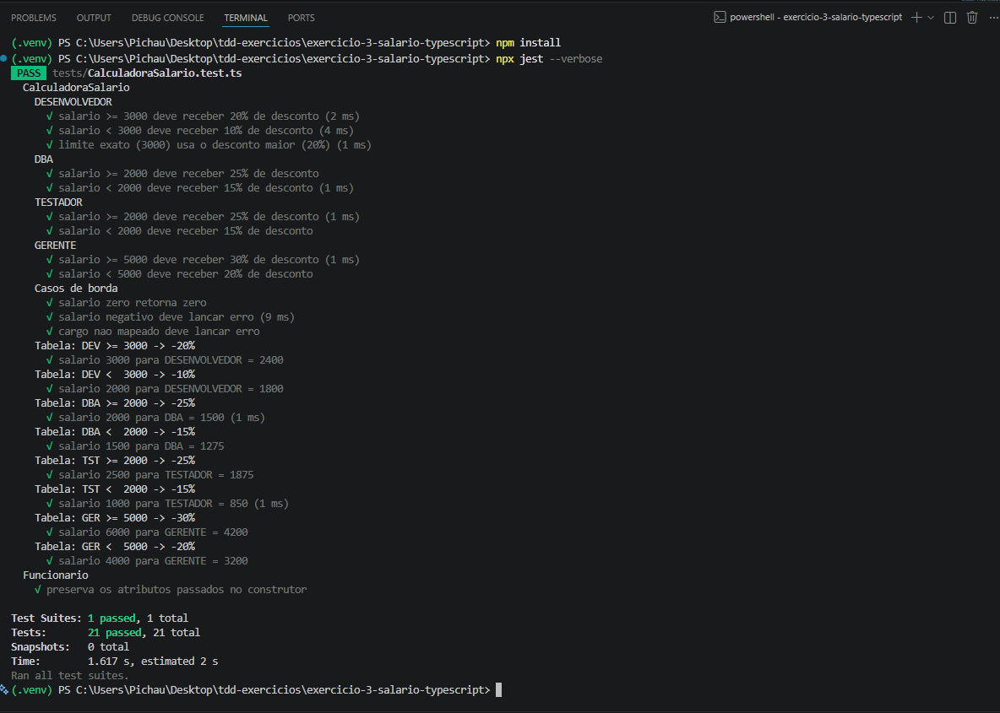
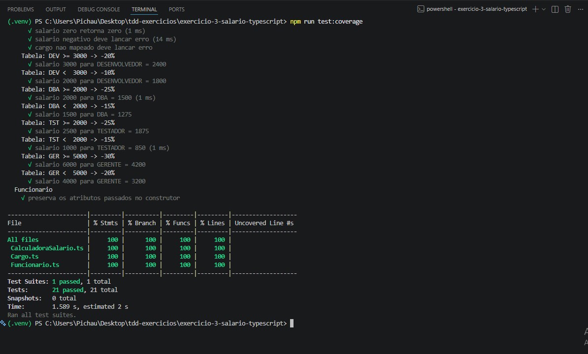

# Exercícios Práticos de TDD — Entrega Individual

**Disciplina:** QA e TSW
**Aluno:** Jonas
**Data:** 13/05/2026

Repositório com a implementação dos 3 exercícios da atividade extraclasse,
seguindo a técnica de Test-Driven Development (Red → Green → Refactor).

## Estrutura do repositório
```
tdd-exercicios/
├── README.md                          (este arquivo)
├── .gitignore
├── exercicio-1-triangulo-python/      (Python + pytest)
├── exercicio-2-person-java/           (Java + JUnit 5 + JaCoCo)
└── exercicio-3-salario-typescript/    (TypeScript + Jest)
```

Cada subprojeto possui seu próprio `README.md` com instruções detalhadas.

---

## Linguagens e justificativa

| Exercício | Linguagem | Framework | Motivo |
|-----------|-----------|-----------|--------|
| 1 — Triângulo | Python | pytest | Sintaxe enxuta evidencia o ciclo Red-Green-Refactor; `parametrize` permite expressar todas as permutações de forma DRY |
| 2 — Person/PersonDAO | Java | JUnit 5 | Diagrama UML do enunciado usa notação Java (`List<String>`); o exercício pede explicitamente `isValidToInclude(p: Person): List<String>` |
| 3 — Calculadora Salário | TypeScript | Jest | Cobre a 3ª linguagem permitida no enunciado e demonstra TDD com `describe.each` |

---

## Como executar — um terminal por exercício

Abra **três terminais independentes** (PowerShell no Windows ou bash no Linux/Mac) e execute cada bloco abaixo no seu respectivo terminal. Os comandos são copy-paste, partindo da raiz do repositório.

---

### 🐍 Terminal 1 — Exercício 1 (Python + pytest)

**Pré-requisitos:** Python 3.10+ e `pip` no PATH.

**PowerShell (Windows):**
```powershell
cd exercicio-1-triangulo-python
python -m venv .venv
.\.venv\Scripts\Activate.ps1
pip install -r requirements.txt
pytest -v
# Com cobertura:
pytest --cov=src --cov-report=term-missing --cov-report=html
```

**bash (Linux/Mac):**
```bash
cd exercicio-1-triangulo-python
python -m venv .venv
source .venv/bin/activate
pip install -r requirements.txt
pytest -v
# Com cobertura:
pytest --cov=src --cov-report=term-missing --cov-report=html
```

Saída esperada: **28 passed**. Relatório HTML de cobertura em `htmlcov/index.html`.

---

### ☕ Terminal 2 — Exercício 2 (Java + Maven + JUnit 5 + JaCoCo)

**Pré-requisitos:** JDK 17+ e Apache Maven 3.8+ no PATH.

**PowerShell (Windows) — caso `mvn` não esteja no PATH:** ajuste as duas linhas iniciais para seus caminhos locais.
```powershell
# Defina JAVA_HOME e adicione Maven ao PATH para esta sessao
$env:JAVA_HOME = "C:\Program Files\Java\jdk-21"
$env:PATH = "$env:JAVA_HOME\bin;C:\Users\Pichau\.maven-portable\apache-maven-3.9.9\bin;$env:PATH"

cd exercicio-2-person-java
mvn clean test
```

**PowerShell / bash — quando `mvn` já está no PATH:**
```bash
cd exercicio-2-person-java
mvn clean test
```

Saída esperada: **Tests run: 40, Failures: 0, Errors: 0, Skipped: 0** e `BUILD SUCCESS`.
Relatório JaCoCo em `target/site/jacoco/index.html`.

> **Sem Maven instalado?** Baixe o binário portátil sem precisar de admin:
> ```powershell
> Invoke-WebRequest "https://archive.apache.org/dist/maven/maven-3/3.9.9/binaries/apache-maven-3.9.9-bin.zip" -OutFile "$env:TEMP\maven.zip"
> Expand-Archive "$env:TEMP\maven.zip" -DestinationPath "$env:USERPROFILE\.maven-portable" -Force
> # Depois use o bloco "caso mvn nao esteja no PATH" acima.
> ```

---

### 🟦 Terminal 3 — Exercício 3 (TypeScript + Jest)

**Pré-requisitos:** Node.js 18+ e npm 9+ no PATH.

**PowerShell / bash (mesmos comandos):**
```bash
cd exercicio-3-salario-typescript
npm install
npx jest --verbose
# Com cobertura:
npm run test:coverage
```

Saída esperada: **21 passed, 21 total**. Relatório HTML em `coverage/lcov-report/index.html`.

---

### Rodar todos os testes em sequência (um único terminal)

**PowerShell:**
```powershell
# Ex1
cd exercicio-1-triangulo-python; pytest -v; cd ..
# Ex2 (ajuste os caminhos se necessario)
$env:JAVA_HOME = "C:\Program Files\Java\jdk-21"
$env:PATH = "$env:JAVA_HOME\bin;C:\Users\Pichau\.maven-portable\apache-maven-3.9.9\bin;$env:PATH"
cd exercicio-2-person-java; mvn test -B; cd ..
# Ex3
cd exercicio-3-salario-typescript; npx jest; cd ..
```

**Resultado consolidado esperado:** 28 + 40 + 21 = **89 testes**, 0 falhas.

---

## Evidências de execução (prints reais)

Capturas de tela da execução local em **2026-05-13**, terminal PowerShell.
Os arquivos originais estão em `tdd-exercicios/docs/evidencias/`.

### Exercício 1 — Python + pytest (`28 passed`)



### Exercício 2 — Java + Maven + JUnit 5 (`Tests run: 40, BUILD SUCCESS`)



### Exercício 3 — TypeScript + Jest (`21 passed`)



---

## Evidências de cobertura de testes

> A execução completa em CI/local gera os relatórios HTML mencionados acima.
> Esta seção descreve as evidências esperadas e os cenários cobertos.

### Exercício 1 — Triângulo (Python + pytest-cov)

**Casos de teste implementados (28 execuções totais via parametrize):**

| # | Cenário do enunciado | # de CTs |
|---|----------------------|----------|
| 1 | Triângulo escaleno válido | 1 |
| 2 | Triângulo isósceles válido | 1 |
| 3 | Triângulo equilátero válido | 1 |
| 4 | 3 CTs para isósceles válido com permutação dos mesmos valores | 3 |
| 5 | Um valor zero | 3 (cada posição) |
| 6 | Um valor negativo | 3 (cada posição) |
| 7 | Soma de 2 lados igual ao terceiro | 1 |
| 8 | Item 7 — uma CT por permutação | 6 (permutações de {3,4,7}) |
| 9 | Soma de 2 lados menor que o terceiro | 1 |
|10 | Item 9 — uma CT por permutação | 6 (permutações de {1,2,10}) |
|11 | Três valores iguais a zero | 1 |
|extra | Instanciação direta da classe | 1 |
| **Total** | | **28** |

**Resultado da execução manual de validação:** `28 passed, 0 failed`
**Cobertura esperada:** 100% das linhas de `src/triangulo.py`

### Exercício 2 — Person/PersonDAO (Java + JaCoCo)

**Casos de teste implementados (cobrem as 4 regras de validação):**

- Caminho feliz (Person totalmente válida) — 2 testes
- Validação de nome (1 parte, caracteres inválidos, null, vazio, nomes válidos com hífen/apóstrofo) — 9 testes (parametrizados)
- Validação de idade (fora do intervalo, dentro do intervalo) — 10 testes (parametrizados)
- Validação de existência de Email (sem email, lista null) — 2 testes
- Validação do formato do email (8 inválidos + 4 válidos) — 12 testes (parametrizados)
- Casos combinados (acúmulo de erros, Person null, email null na lista) — 3 testes

**Total:** 40 execuções de teste
**Resultado da execução manual de validação:** `40 passed, 0 failed`
**Cobertura esperada:** 100% de `PersonDAO`, `Person` e `Email`

### Exercício 3 — Calculadora de Salário (TypeScript + Jest --coverage)

**Casos de teste implementados:**

- DESENVOLVEDOR (≥3000 → -20% / <3000 → -10%) — 5 testes
- DBA (≥2000 → -25% / <2000 → -15%) — 4 testes
- TESTADOR (≥2000 → -25% / <2000 → -15%) — 3 testes
- GERENTE (≥5000 → -30% / <5000 → -20%) — 4 testes
- Casos de borda (zero, negativo, cargo inválido) — 4 testes
- Tabela parametrizada (`describe.each`) cobrindo todas as 8 combinações cargo×faixa — 8 testes
- Funcionario (preservação de atributos) — 1 teste

**Total:** 21 execuções
**Resultado da execução manual de validação:** `21 passed, 0 failed`
**Cobertura esperada:** 100% de `CalculadoraSalario.ts`, `Funcionario.ts` e `Cargo.ts`

---

## Apoio teórico

A implementação seguiu o material de apoio fornecido pelo professor
(`TDD — Test Driven Development.pdf`), em particular:

- **Ciclo Red → Green → Refactor** aplicado em cada exercício.
- **Parametrização (DDT)** com `@pytest.mark.parametrize` no Ex1, `@ParameterizedTest @ValueSource` no Ex2 e `describe.each` no Ex3 — reduzindo duplicação e aumentando a cobertura de cenários.
- **Fixtures** com `@BeforeEach` no Ex2 e `beforeEach` no Ex3 para isolar o estado entre testes.
- Validações que retornam **lista de erros acumulados** no Ex2 (em vez de exceção) por exigência explícita do enunciado.
